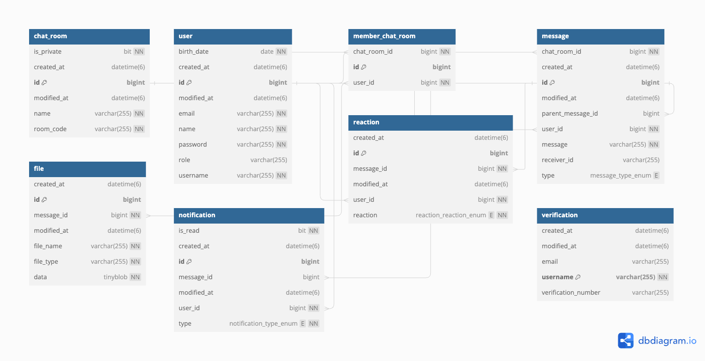

# 💬 Chat Connect
### 실시간 채팅 애플리케이션 & 이벤트 기반 알림

설명: 사용자가 다양한 기능을 활용하여 실시간으로 소통하고 정보를 공유할 수 있는 플랫폼입니다.
추가적인 기능으로 이벤트 기반 알림, 메시지 반응, 주제 및 투표, 파일 공유 및 미디어 미리보기 등을 제공합니다.

----
# 주요 기능
## 회원 / 유저 관리
### 회원 가입
- 회원 가입 정보:
    - [PK] 로그인 아이디 (이메일)
        - 이베일 형태만 입력
        - 중복 불가능
        - 한번 설정하면 변경 불가능
    - 이름
        - 변경 가능 (유사 nickname)
    - 비밀번호
        - passwordEncoder로 암호화해서 저장
    - 생년월일
- 회원 가입 절차:
    - 이메일을 통한 본인 인증 후 회원 가입 가능
    - 소셜 로그인 연동 <b>(Naver, Kakao, Google)</b>

### 회원 로그인 / 로그아웃
- 로그인:
    - 아이디와 비밀번호 입력
    - Spring Security, OAuth 2.0, JWT를 이용한 인증
- 로그아웃:
    - 세션 무효화 및 JWT 토큰 삭제
- 아이디 찾기 / 비밀번호 초기화:
    - 이메일을 통한 아이디 찾기 및 비밀번호 초기화 기능
### 회원 정보 수정
- 수정 가능한 정보:
    - 이름
- 절차:
    - 기존 비밀번호 확인 후 새로운 정보 입력
### 회원 탈퇴
- 절차:
    - 회원 정보 수정 페이지에서 탈퇴 기능 제공
    - 탈퇴 사유 선택 (선택 사항)
## 채팅 관리
### 채팅방 생성
- 기능:
    - 채팅방 이름 입력
    - 공개/비공개 설정
    - WebSocket을 이용한 실시간 채팅
### 채팅방 조회
- 기능:
    - 채팅방 목록 조회
    - 이름으로 채팅방 검색 (Elasticsearch 사용)
### 채팅방 참여
- 기능:
    - 채팅방 참여 및 메시지 전송
## 메시지 관리
### 메시지 작성
- 기능:
    - 메시지 내용 입력 및 전송
    - 작성자 이름, 작성 시간 자동 기록
    - 메세지 @ 태그 멘션

### 메시지 조회
- 기능:
    - 특정 채팅방의 메시지 목록 조회 (Elasticsearch 사용)

### 메시지 수정
- 기능:
    - 작성자 본인만 메시지 내용 수정 가능
    - 수정 시간 자동 기록

### 메시지 삭제
- 기능:
    - 작성자 본인만 메시지 삭제 가능

### 이벤트 기반 알림
- 기능:
    - 사용자 멘션, 메시지 반응, 새로운 메시지 등에 대한 실시간 알림

### 메시지 반응
- 기능:
    - 메시지에 이모지 반응 추가

### 메시지 스레드
- 기능:
    - 메시지에 대한 스레드형 답글 작성 가능 (depth 1)

### 파일 공유 및 미디어 보기
- 기능:
    - 파일, 이미지 공유

## 추후에 추가할 기능:
### 내 현재 위치 보내기
- 기능:
    - 사용자의 현재 위치 공유 (카카오나 google map api 활용)

## ERD

## Tech Stack

  
  
  
  
  
  
  
  
  
  
  

